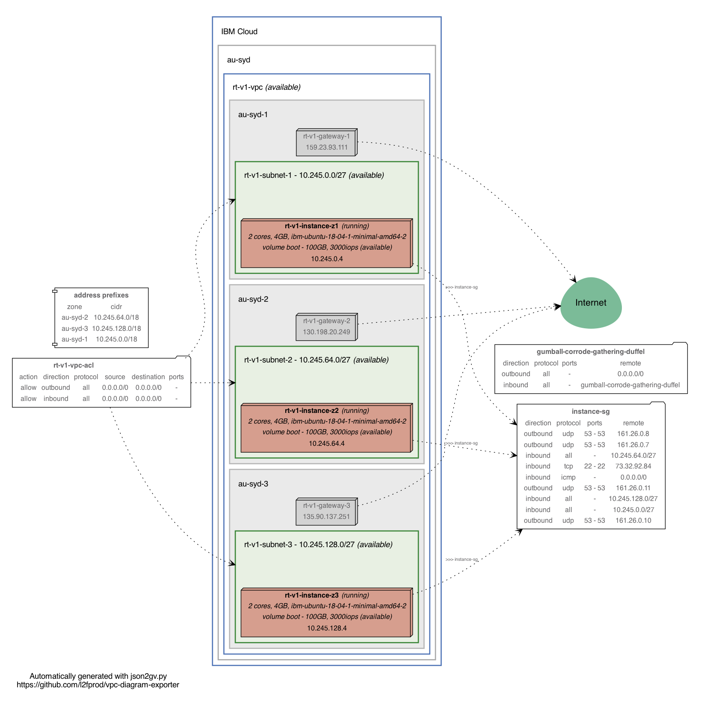

# MZR Deployment in IBM Cloud VPC

This repository has code that will allow you to deploy a bastion host as well as 3 webservers, each in a different zone within a VPC. The webservers will be configured using Ansible. All Ansible commands will go through the Bastion instance.

## Deploying resources

1. Copy terraform.tfvars.template to terraform.tfvars:

```shell
cp terraform.tfvars.template terraform.tfvars
```

2. Edit `terraform.tfvars` to match your environment
You will need to fill in the following details
 - basename = This is a prefix for all resource names
 - region = The IBM Cloud VPC region to deploy your resources.
 - resource_group = All resources will be deployed in to this Resource Group.
 - remote_ip = The local IP you are running this deployment from. It will be the only IP allowed to SSH in to the bastion host. 
 - ssh_key = The SSH key name that will be added to your compute instances.




## Current State
 - [x] Deploy VPC and Networking across 3 zones in a region 
 - [x] Create instance security group for webservers
 - [ ] Move SSH in rule to new bastion security group and remove from instance sg
 - [ ] Create bastion host in zone 1 of region 
 - [ ] Adjust instance sg to only allow SSH in from bastion IP
 - [ ] Create Ansible templates